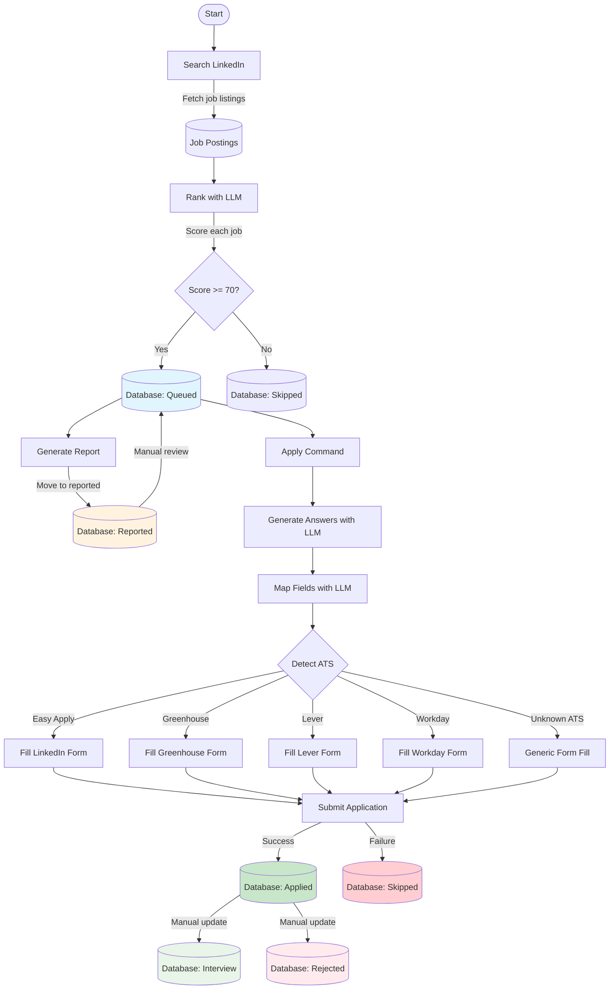
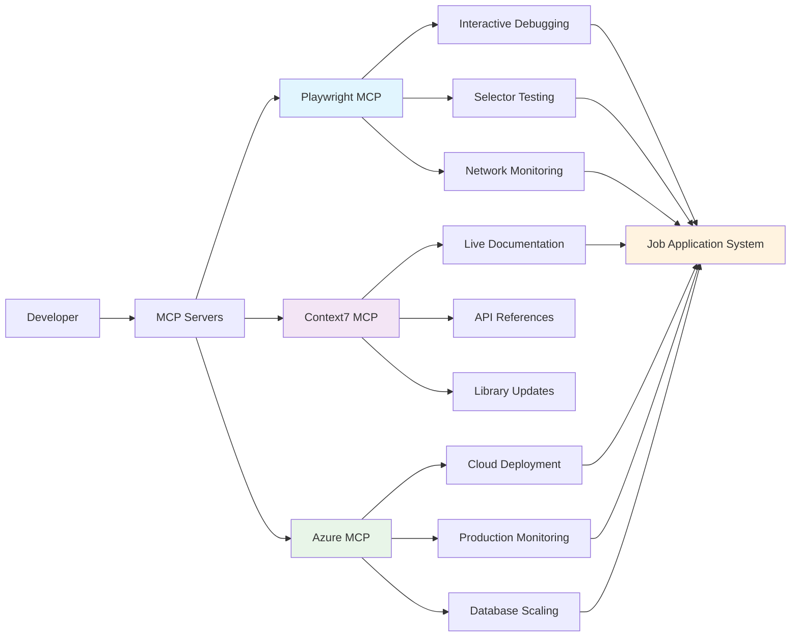

# LinkedIn Job Application Automation

Automatically search, rank, and apply to LinkedIn jobs using local AI.

> **Note for AI Assistants**: This project uses `.cursorrules` to guide development. When updating the codebase, ensure `.cursorrules` stays synchronized with this README and the actual implementation details. If architectural changes are made, update `.cursorrules` accordingly to maintain accurate context for AI-assisted development.

## Requirements

- **Node.js 20+**: https://nodejs.org/
- **Docker Desktop**: https://www.docker.com/products/docker-desktop/
- **Git**: https://git-scm.com/downloads

## Setup

```bash
git clone <repository-url>
cd job-apply
npm install
npx playwright install
```

Start the local LLM (downloads ~5GB on first run):

```bash
docker compose -f docker-compose.llm.yml up -d
```

Login to LinkedIn:

```bash
npm run login
```

Browser opens for LinkedIn login. Complete authentication, then press ENTER in terminal.

## Transferring to New Computer

When moving to a new computer, you need to transfer these files to preserve your data and configuration:

### Required Files

**Environment Configuration:**
- `.env` - Your personal settings (MIN_FIT_SCORE, LLM_MODEL, HEADLESS, ENABLE_TRACING)
- `.env.local` - Any local environment overrides

**Personal Documents:**
- `resumes/` folder contents - Your PDF/DOCX resume files for AI context

**Session Data:**
- `storage/storageState.json` - LinkedIn session state (avoids re-login)

**Application Data:**
- `data/app.db` - SQLite database with all job data, applications, and learning history
- `data/app.db-shm` and `data/app.db-wal` - SQLite temporary files (if they exist)

**Configuration Files:**
- `answers-policy.yml` - Controls form field validation and response policies

### Optional Files

**Debug Artifacts (if preserving debugging history):**
- `artifacts/` folder - Screenshots and traces from failed applications

**Generated Reports (if keeping historical reports):**
- `reports/` folder - Any generated HTML reports

### What You DON'T Need to Transfer

These are automatically generated or recreated:
- `node_modules/` - Recreated with `npm install`
- `dist/` - Dashboard build output, recreated with `npm run dashboard:build`
- SSL certificates (`*.pem`, `*.key`, `*.crt`) - Generated automatically for HTTPS
- Log files (`*.log`) - Temporary files

### Setup Steps on New Computer

1. **Clone the repository**
2. **Transfer the required files above** to their respective locations
3. **Install dependencies**: `npm install`
4. **Install Playwright**: `npx playwright install`
5. **Start LLM**: `docker compose -f docker-compose.llm.yml up -d`
6. **Login** (if you didn't transfer session): `npm run login`

### Most Critical Files

The most important files to transfer are:
1. **`.env`** - Your configuration
2. **`resumes/`** - Your resume files for AI context
3. **`data/app.db`** - Your job data and learning history
4. **`answers-policy.yml`** - Your form response policies

Without these, you'll lose your job data, learning history, and need to reconfigure everything.

## Quick Command Reference

**Looking for something specific?**

- **Daily Operations** → [Usage](#usage) - Search, apply, status, dashboard
- **Testing & Debugging** → [Admin & Testing Commands](#admin--testing-commands) - Reset database, clear cache, run tests
- **Issues & Errors** → [Troubleshooting](#troubleshooting) - Common problems and solutions
- **Customization** → [Configuration](#configuration) - Adjust scoring, filters, settings

## Usage

This section covers day-to-day commands for normal operation. For admin, testing, and debugging commands, see [Admin & Testing Commands](#admin--testing-commands).

### Search for Jobs

```bash
# Basic search
npm run search "Software Engineer"

# With filters
npm run search "Data Analyst" -- --remote --date week --min-score 80

# Profile-based search
npm run search -- --profile core
npm run search -- --profile security
npm run search -- --profile backend

# Start from specific page
npm run search -- --profile core --start-page 2
npm run search -- --profile security --start 3 --max-pages 2
```

Available profiles: `core`, `security`, `event-driven`, `performance`, `devops`, `backend`, `core-net`, `legacy-modernization`

#### Profile Descriptions

- **`core`**: Azure API Engineer roles with API Management, Functions, and Service Bus
- **`security`**: Security-focused roles with OAuth, JWT, Entra ID, and API Governance  
- **`event-driven`**: Event-driven architecture roles with Service Bus, Event Grid, and messaging
- **`performance`**: Performance optimization roles with load testing, Redis, and monitoring
- **`devops`**: DevOps roles with Azure DevOps, GitHub Actions, Docker, and infrastructure
- **`backend`**: General backend development roles with Azure, .NET, and APIs
- **`core-net`**: Core .NET development roles with C#, ASP.NET, MVC, and Entity Framework
- **`legacy-modernization`**: Legacy system modernization roles with VB.NET, WebForms, ASP.NET MVC, and cloud migration

#### Copy-Paste Profile Commands

```bash
npm run search -- --profile core
npm run search -- --profile security
npm run search -- --profile event-driven
npm run search -- --profile performance
npm run search -- --profile devops
npm run search -- --profile backend
npm run search -- --profile core-net
npm run search -- --profile legacy-modernization
```

### Check Status

```bash
# View statistics summary
npm run status

# List jobs by status
npm run list queued
npm run list reported
npm run list applied
npm run list rejected
npm run list skipped
```

### Apply to Jobs

```bash
# Test run (doesn't submit)
npm run apply -- --easy --dry-run

# Apply to Easy Apply jobs
npm run apply -- --easy

# Apply to external sites (Greenhouse, Lever, Workday)
npm run apply -- --ext
```

### Technology Filters

Filter out jobs with unwanted technologies before ranking:

```bash
# Add filters for Go, Java, Python-focused, Ruby, PHP, etc.
npm run filters:add

# List active filters
npm run filters:list

# Remove all tech filters
npm run filters:remove
```

The Technology Filter System blocks jobs containing unwanted tech stacks (Go, Java, etc.) before they're even ranked, saving processing time and focusing on Microsoft stack positions. Jobs with Node.js, TypeScript, React, Angular, and Terraform are NOT filtered.

See [Technology Filter Guide](docs/TECH_FILTER_GUIDE.md) for detailed configuration.

### Dashboard

Monitor your automation in real-time with the web dashboard.

**Initial Setup:**
```bash
# Install dependencies (if not already done)
npm install

# Start the dashboard
npm run dashboard:dev
```

This starts:
- Backend API server on **https://localhost:3001**
- Frontend React app on **https://localhost:3000**

**Access the Dashboard:**
Open https://localhost:3000 to access:
- Live job statistics and success rates
- Complete jobs list with filtering
- Activity log with run history
- Auto-refreshing every 5 seconds

**Dashboard Features:**
- Real-time job statistics with success rate calculation and trend tracking
- AI-generated professional headline summaries for job applications
- AI-powered cover letter generation based on job fit analysis
- Filterable jobs table with status and Easy Apply filtering
- Comprehensive analytics: application timeline, company statistics, rank distribution
- Rejection learning system monitoring with weight adjustments and pattern tracking
- Activity log with run history and success/failure indicators
- Screenshot availability indicators for debugging
- Responsive layout with tab-based navigation
- **Automation tab** with live command execution and terminal-style log streaming

**Automation Tab:**

The Automation tab provides a graphical interface to run search and apply commands with real-time log output:

**Features:**
- Run search and apply commands without using the terminal
- Live log streaming in terminal-style display (black background, green text)
- Full configuration controls matching all CLI options
- Start/Stop buttons with graceful shutdown
- Auto-scrolling terminal with manual scroll override
- Status indicators (Idle/Running/Stopping/Error)
- Only one automation job can run at a time (enforced)

**Search Options:**
- Profile selection (core, security, event-driven, etc.) or custom keywords
- Location, remote filter, date posted filter
- Min score threshold, max pages, start page
- Update missing job descriptions option

**Apply Options:**
- Easy Apply only or External ATS only
- Specific job ID targeting
- Dry run mode (test without submitting)

**Usage:**
1. Navigate to the **Automation** tab in the dashboard
2. Select **Search** or **Apply** command
3. Configure options using the form controls
4. Click **Start** to begin execution
5. Monitor live output in the terminal display
6. Click **Stop** to gracefully cancel (finishes current operation)

The terminal display auto-scrolls as logs arrive. Manual scrolling pauses auto-scroll; click "Resume Auto-scroll" to re-enable. The "Clear" button is available when the job is idle.

**Stop the Dashboard:**
Press `Ctrl+C` in the terminal where the dashboard is running.

See [Dashboard Quick Start](docs/DASHBOARD_QUICKSTART.md) for detailed setup guide and troubleshooting.

## Admin & Testing Commands

This section covers commands for database management, testing, debugging, and development. These are primarily for testing workflows, troubleshooting issues, and maintaining the system.

### ⚠️ Database Safety System

**IMPORTANT**: All database-modifying scripts now include automatic safety features:

1. **Automatic Backups**: Every script that modifies the database creates an automatic timestamped backup in `data/backups/` before making ANY changes
2. **Safety Confirmations**: Destructive operations require a 5-second confirmation wait (press Ctrl+C to cancel)
3. **Test Isolation**: All automated tests use in-memory databases and never touch production data
4. **Backup Rotation**: Old backups are automatically cleaned up (keeps last 10)

**Before running ANY database-modifying command, the system will:**
- Create a backup at `data/backups/app.db.auto-backup-YYYY-MM-DD...`
- Show you what will be affected
- Give you 5 seconds to cancel (Ctrl+C)

**If something goes wrong:**
```bash
# List your backups
ls data/backups/

# Restore from a specific backup
cp data/backups/app.db.auto-backup-2025-10-26... data/app.db

# Or use the inspect and restore commands
npm run backup:inspect
npm run backup:restore
```

### Database Reset Operations

Use these commands to reset the database state for testing or to recover from issues:

```bash
# Clear the queue (queued → skipped)
# SAFE: Only changes status, doesn't delete data
npm run reset:queue

# Restore the queue (skipped → queued)  
# SAFE: Only changes status, doesn't delete data
npm run reset:restore

# Reset applied/rejected/interview jobs back to queued
# SAFE: Only changes status, doesn't delete data
npm run reset:applied

# Delete all jobs (keeps profile, skills, learning data)
# ⚠️ DESTRUCTIVE: Auto-backup + 5-second confirmation
npm run reset:jobs

# Full reset - delete jobs and all caches (keeps profile/skills)
# ⚠️ DESTRUCTIVE: Auto-backup + 5-second confirmation
npm run reset:full

# Nuclear reset - delete EVERYTHING including profile
# ⚠️⚠️ EXTREMELY DESTRUCTIVE: Auto-backup + 5-second confirmation
npm run reset:nuclear
```

**What happens when you run a destructive command:**
```
$ npm run reset:jobs

💾 Auto-backup created: data/backups/app.db.auto-backup-2025-10-26T14-30-15

⚠️  DESTRUCTIVE OPERATION
============================================================
Operation: Delete all jobs
Jobs affected: 249
⚠️  THIS WILL DELETE DATA PERMANENTLY
============================================================

A backup has been created automatically.
Press Ctrl+C to cancel, or wait 5 seconds to continue...

✅ Deleted 249 jobs
```

**Common Testing Workflows:**

```bash
# Testing application flow
npm run reset:queue              # Clear queue for fresh start
npm run search -- --profile core # Search for new jobs
npm run apply -- --easy          # Apply to jobs
npm run status                   # Check results

# Re-test applications
npm run reset:applied            # Move applied jobs back to queue
npm run apply -- --dry-run       # Test without submitting

# Start completely fresh
npm run reset:full               # Clear everything except profile
npm run search -- --profile core # Rebuild job queue
```

### Manual Backup & Restore

Create manual backups before major operations:

```bash
# Create a timestamped manual backup
npm run backup

# Inspect what's in your databackup/ folder
npm run backup:inspect

# Restore from databackup/ folder
npm run backup:restore
```

**Manual vs Automatic Backups:**
- **Automatic**: Created automatically before ANY database-modifying script
  - Location: `data/backups/app.db.auto-backup-*`
  - Retention: Last 10 kept automatically
- **Manual**: Created when you run `npm run backup`
  - Location: `data/backups/app.db.backup-*`
  - Retention: You manage these manually

### Cache Management

Clear cached data when testing AI responses or form mappings:

```bash
# Clear all caches
# SAFE: Only clears cache tables, doesn't affect jobs or profile
npm run clear-cache

# Clear specific cache types
npm run clear-cache answers    # Clear generated application answers
npm run clear-cache mapping    # Clear form field mappings
```

### Safety System Verification

Verify that all safety features are working correctly:

```bash
# Verify database safety system
npm run verify:safety
```

This runs comprehensive tests to verify:
- Database path selection (production vs test)
- Automatic backup creation
- Test database initialization
- Read-only and backup options
- Backup directory structure

### Test Suites

Run automated tests to verify system functionality:

```bash
# Run all test suites (recommended)
npm run test:all

# Run learning system tests only
npm run test:learning

# Run individual test suites
npm test
npx tsx --test tests/login.test.ts
npx tsx --test tests/search.test.ts
npx tsx --test tests/mapper.test.ts
npx tsx --test tests/ranker.test.ts
npx tsx --test tests/integration.test.ts
```

### Debug with MCP Servers

This project integrates with MCP servers for interactive debugging and development:

**Playwright MCP Server** - Interactive browser debugging:
- `browser_snapshot` - See current page state with accessibility tree
- `browser_click` - Test selectors interactively
- `browser_network_requests` - Debug form submissions
- `browser_console_messages` - See JavaScript errors
- `browser_take_screenshot` - Capture visual state

**Context7 MCP Server** - Up-to-date documentation:
- Get live Playwright documentation for browser automation
- Get TypeScript documentation for type safety
- Get React documentation for dashboard development
- Access latest API references and examples

**Azure MCP Server** - Cloud management:
- Deploy dashboard to Azure App Service
- Set up Azure Monitor for production monitoring
- Query Log Analytics for application insights
- Migrate to Azure Cosmos DB for scaling

### Verification Commands

Verify system health and safety:

```bash
# Verify database safety system
npm run verify:safety

# Inspect backup data
npm run backup:inspect
```

### Direct Script Access

Advanced users can run scripts directly with custom options:

```bash
# Database reset with specific option
# SAFETY: Auto-backup created automatically
node scripts/reset-database.js [queue|restore|applied|jobs|full|nuclear]

# Setup user profile
# SAFETY: Auto-backup created automatically
node scripts/setup-profile.js

# Export database to JSON/SQL
# SAFE: Read-only operation
node scripts/export-database.js

# Recalculate job rankings
# SAFETY: Auto-backup created automatically
node scripts/recalculate-ranks.js

# Verify ranking scores
# SAFE: Read-only operation
node scripts/verify-ranks.js

# Backfill rejection learning from historical data
# SAFETY: Uses db.ts with safety checks
node scripts/backfill-rejection-learning.js
```

## Configuration

Edit `.env` file:

- `MIN_FIT_SCORE`: Minimum score to queue jobs (default: 70)
- `LLM_MODEL`: AI model (default: llama3.1:8b)
- `HEADLESS`: Run browser in background (true/false)
- `ENABLE_TRACING`: Save debug logs (true/false)

Edit `answers-policy.yml` to control application form responses (field length, allowed values, etc.)

Place resumes (PDF or DOCX) in `resumes/` folder.

## Job Scoring System

### How Jobs Are Evaluated

Jobs go through a two-stage process:

**Stage 1: Technology Filters** (Pre-screening)
- Blocks jobs with unwanted technologies (Go, Java, Python-focused, etc.) before ranking
- Saves processing time by filtering out non-Microsoft stack positions immediately
- Configurable via `npm run filters:add` command
- See [Technology Filter Guide](docs/TECH_FILTER_GUIDE.md)

**Stage 2: Profile-Specific AI Scoring** (Jobs that pass filters)
- Each search profile uses different weight distributions across 9 categories
- Same job scores differently depending on which profile found it
- Examples:
  - **Security profile**: Security 35%, Seniority 15%, Azure 15%, .NET 15%
  - **Performance profile**: Performance 30%, .NET 20%, Azure 15%
  - **Core-net profile**: .NET 40%, Performance 15%, Azure 10%
- Weights stored with each job for accurate re-scoring
- Global learning adjustments apply on top of profile-specific weights
- Scores above 70 are queued for application (configurable via MIN_FIT_SCORE in .env)

See [Profile-Specific Scoring](docs/PROFILE_SPECIFIC_SCORING.md) for technical details.

### Current Preferences

**Technology Stack:**
- **Favored**: C#, .NET Core, Azure, APIM, SQL Server, Entity Framework
- **Acceptable**: Node.js, TypeScript, React, Angular, Terraform (complementary technologies)
- **Filtered Out**: Go, Java (except JavaScript), Python-focused roles, Ruby, PHP

**Other Preferences:**
- **Frontend Frameworks**: Prioritizes Blazor and React over Angular
- **Remote Work**: Strong emphasis on fully remote positions over hybrid or on-site

### Customization

- **Adjust Weights**: See [Ranking Customization Guide](docs/RANKING_CUSTOMIZATION_GUIDE.md)
- **Add/Remove Technology Filters**: See [Technology Filter Guide](docs/TECH_FILTER_GUIDE.md)
- **Create New Profiles**: See [Profile Creation Guide](docs/PROFILE_CREATION_GUIDE.md)

## Troubleshooting

### Common Issues

**AI not responding or slow:**
```bash
# Check if Ollama is running
docker ps

# Restart Ollama container
docker compose -f docker-compose.llm.yml restart

# Check Ollama logs
docker compose -f docker-compose.llm.yml logs
```

**LinkedIn session expired:**
```bash
# Re-authenticate with LinkedIn
npm run login
```

**Application failures or unexpected behavior:**
```bash
# Check debug artifacts
ls artifacts/  # Screenshots and traces from failed applications

# Clear caches and retry
npm run clear-cache
npm run apply -- --job <job-id> --dry-run

# View detailed logs in terminal output
```

**Database issues:**
```bash
# Check database status
npm run status

# Export database for inspection
node scripts/export-database.js

# Reset to clean state (careful - deletes data)
npm run reset:full
```

**Form filling failures:**
```bash
# Clear cached field mappings
npm run clear-cache mapping

# Run with tracing enabled
# Edit .env: ENABLE_TRACING=true
npm run apply -- --easy

# Check artifacts/traces/ for detailed execution logs
```

## Key AI Features

This system uses local AI (Ollama) to provide sophisticated automation:

- **Job Ranking**: Analyzes job descriptions against your profile with weighted category scoring (Azure/API 20%, Security 15%, .NET 20%, etc.)
- **Professional Headlines**: Generates customized one-sentence summaries for each job application that highlight your relevant expertise
- **Cover Letters**: Creates job-specific cover letters based on fit analysis, required skills, and your profile
- **Form Field Mapping**: Intelligently maps application questions to your answers using semantic understanding
- **Rejection Learning**: Analyzes rejection reasons to automatically adjust scoring weights and filter out similar jobs

All AI processing runs locally without external API calls, ensuring privacy and zero costs.

## LLM Tasks Overview

The system makes 5 types of LLM calls. Here's what each does, when it runs, and how long it takes:

### 1. Job Ranking (Most Frequent)
**File**: `src/ai/ranker.ts`
**When**: During search command, once per job found
**What it does**: 
- Evaluates job description against all profile categories (Azure, Security, .NET, Event-Driven, Performance, Frontend, Legacy Modernization, DevOps)
- Returns 0-100 score for each category plus reasons, blockers, missing keywords
- System calculates final weighted score using current profile weights

**Input size**: ~1000 chars (truncated job description)
**Output**: JSON with category scores, fit reasons, must-haves, blockers, missing keywords
**Settings**: Temperature 0.1, 3 retries
**Performance**: ~2-5 seconds per job (depends on job description complexity)
**Frequency**: 10-25 calls per search page (most expensive operation)

### 2. Form Field Mapping (Conditional)
**File**: `src/ai/mapper.ts`
**When**: During apply command, only for unmapped fields
**What it does**:
- Three-tier system: heuristics (instant) → cache (instant) → LLM (slow)
- LLM only called when field label doesn't match heuristics and isn't cached
- Maps ambiguous form field labels to canonical keys (email, phone, work_authorization, etc.)

**Input size**: List of field labels (usually 5-15 labels)
**Output**: JSON mapping each label to canonical key
**Settings**: Temperature 0.1, 2 retries
**Performance**: ~1-2 seconds per batch
**Frequency**: Rare (only for new/ambiguous fields, then cached)

### 3. Rejection Analysis (Manual Only)
**File**: `src/ai/rejection-analyzer.ts`
**When**: When user manually updates job to "rejected" status with reason
**What it does**:
- Analyzes rejection reason text to identify patterns (seniority, tech stack, location, compensation, company fit)
- Uses dual approach: keyword extraction (instant) + LLM semantic analysis
- Suggests weight adjustments for profile categories
- Recommends filters to avoid similar jobs

**Input size**: Rejection reason text + job details (~500 chars)
**Output**: JSON with patterns, suggested adjustments, filters
**Settings**: Temperature 0.1, 3 retries
**Performance**: ~2-4 seconds per rejection
**Frequency**: Rare (only when user reports rejection, fallback to keywords if LLM fails)

### 4. Answer Synthesis (Per Application)
**File**: `src/ai/answers.ts`
**When**: During apply command, once per job (then cached)
**What it does**:
- Generates complete set of application answers (name, email, phone, city, work authorization, sponsorship, years of experience, LinkedIn URL, why_fit statement)
- Uses candidate profile + job description to customize responses
- Selects best resume variant for the job

**Input size**: Profile + job description + candidate info (~1500 chars)
**Output**: JSON with all answer fields
**Settings**: Temperature 0.2, 2 retries
**Performance**: ~2-4 seconds per job
**Frequency**: Once per application (then cached in database)

### 5. Headline Generation (On-Demand)
**File**: `src/dashboard/routes/headline.ts`
**When**: When user clicks "Generate Headline" in dashboard
**What it does**:
- Creates one professional sentence (max 150 chars) introducing candidate for application form
- Uses candidate profile, job details, fit reasons, and key requirements
- Returns plain text (not JSON)

**Input size**: Profile summary + job details + fit analysis (~800 chars)
**Output**: Plain text headline sentence
**Settings**: Temperature 0.7, no retries
**Performance**: ~1-3 seconds
**Frequency**: On-demand only (user-triggered from dashboard)

### What About Cover Letters?
**File**: `src/dashboard/routes/cover-letter.ts`
**LLM Usage**: None - uses template-based generation, not LLM

### Performance Summary
**Typical search workflow** (25 jobs):
- 25 ranking calls: ~50-125 seconds (bulk of time)
- Total search time: ~1-2 minutes

**Typical apply workflow** (1 job, first time):
- 1 answer generation: ~3 seconds
- 0-1 field mapping: ~0-2 seconds (only if new fields)
- Total apply time: ~5-10 seconds (most time is browser automation)

**Subsequent applications**:
- Answers are cached, so only browser automation time

### Optimization Strategies
1. **Ranking**: Job descriptions truncated to 1000 chars (preserves sections)
2. **Mapping**: Three-tier system avoids LLM calls for 95% of fields
3. **Answers**: Results cached per job ID in database
4. **Headlines**: Plain text output (faster than JSON parsing)
5. **All calls**: Retry logic with exponential backoff, 180-second timeout

### When LLM Calls Fail
- **Ranking**: Job is skipped, error logged to database
- **Mapping**: Falls back to heuristics or marks field as "unknown"
- **Rejection Analysis**: Falls back to keyword-only analysis
- **Answers**: Application fails, user notified
- **Headlines**: User sees error message in dashboard

## How It Works



## MCP Servers Integration



## Advanced Features

This application demonstrates sophisticated capabilities that can be applied to any AI-powered scraping and automation system:

### 🤖 **Intelligent Content Analysis & Ranking**
- **Profile-Specific Weight Distributions**: Each search profile uses different weight emphasis across 9 categories (security profile emphasizes security 35%, performance profile emphasizes performance 30%, etc.)
- **Multi-criteria AI Scoring**: Weighted scoring with global learning adjustments that adapt based on rejection patterns
- **Profile-based Boolean Search**: Pre-defined search profiles with complex Boolean queries for targeted discovery
- **Dynamic Content Extraction**: Robust selectors with fallback mechanisms for handling changing website structures
- **Semantic Job Matching**: AI-powered analysis of job descriptions against user profiles with detailed reasoning
- **Persistent Profile Storage**: Jobs store which profile found them for accurate re-scoring and analytics

### 🧠 **Advanced AI Integration**
- **Local LLM Processing**: Runs entirely offline using Ollama with configurable models and temperature settings
- **AI-Generated Professional Headlines**: Automatically generates one-sentence summaries for job application forms, customized to each position
- **AI-Powered Cover Letter Generation**: Creates job-specific cover letters based on fit analysis, category scores, and candidate profile
- **Structured AI Output**: Enforces JSON schema validation with retry logic for consistent AI responses
- **Context-Aware Generation**: Uses RAG (Retrieval-Augmented Generation) with resume context for personalized responses
- **Multi-step AI Workflows**: Chained AI operations (ranking → answer generation → field mapping → headline/cover letter generation) with error handling

### 🔄 **Smart Form Automation**
- **ATS Detection & Adaptation**: Automatically detects and adapts to different Applicant Tracking Systems (Greenhouse, Lever, Workday)
- **Intelligent Field Mapping**: Three-tier mapping system (heuristics → cache → AI) for optimal performance and accuracy
- **Selector Learning System**: Captures and learns CSS selectors from successful form fills, improving reliability over time
- **Generic Form Fallback**: Handles unknown form types with intelligent field detection and filling
- **Resume Upload Automation**: Automatic file upload with multiple format support

### 📊 **Real-time Monitoring Dashboard**
- **Live Statistics**: Real-time metrics with auto-refresh and success rate calculations
- **Application Timeline Analytics**: Track application trends over time with manual vs automatic method breakdown
- **Company Performance Tracking**: Per-company statistics including success rates, average rankings, and interview conversion
- **Rank Distribution Analysis**: Visualize job score distribution to optimize filtering thresholds
- **Rejection Learning Monitor**: View active weight adjustments, rejection patterns, and learning history in real-time
- **Comprehensive Activity Logging**: Detailed execution logs with timestamps, screenshots, and error tracking
- **Multi-view Interface**: Dashboard overview, detailed job lists, activity monitoring, and learning insights in separate views

### 🧠 **Rejection Reason Learning System**
- **Immediate Weight Adjustment**: Each rejection triggers analysis using keyword patterns and LLM to adjust profile category weights automatically
- **Pattern-Based Filtering**: Builds blocklists for companies with repeated rejections and avoids jobs with problematic keywords
- **Manual Technology Filters**: Pre-emptively block unwanted tech stacks (Go, Java, etc.) before any ranking occurs
- **Dual Analysis Methods**: Combines keyword extraction for common patterns with LLM-powered analysis for nuanced rejection reasons
- **Real-time Learning**: System learns from rejections immediately, adjusting scoring weights and building filters without manual intervention
- **Dashboard Monitoring**: View active weight adjustments, rejection patterns, and learning history in real-time
- **Intelligent Filtering**: Filters jobs before ranking to save processing time and avoid similar rejections

**Example Learning Scenarios:**
- Multiple "too junior" rejections → increases seniority weight and filters junior-level jobs
- "Wrong tech stack - no Python" rejections → blocks Python jobs and adjusts tech stack weights
- Repeated rejections from same company → adds company to blocklist
- "Not remote" rejections → increases remote work weight and filters on-site jobs
- Manual tech filters → blocks Go, Java, Python-focused roles before they're ranked

### 🛡️ **Enterprise-Grade Resilience**
- **Exponential Backoff Retry**: Intelligent retry mechanisms with configurable delays and maximum attempts
- **Screenshot & Trace Capture**: Automatic debugging artifacts for failed operations
- **Session Management**: Persistent browser sessions with automatic restoration
- **Error Recovery**: Graceful handling of network issues, timeouts, and unexpected page changes

### ⚡ **Performance Optimization**
- **Multi-level Caching**: Answers cache, label mapping cache, and database query optimization
- **Batch Processing**: Efficient handling of multiple items with progress tracking
- **Configurable Delays**: Human-like behavior simulation with random timing variations
- **Database Transactions**: Atomic operations with rollback capabilities for data integrity

### 🔧 **Advanced Configuration**
- **Environment-based Settings**: Comprehensive configuration via environment variables
- **Policy-driven Validation**: YAML-based policy files for controlling AI responses and behavior
- **Modular Architecture**: Pluggable adapters and components for easy extension
- **Dry Run Capabilities**: Safe testing mode for validating operations without side effects

### 📈 **Data Management & Analytics**
- **Comprehensive Status Tracking**: Six-state job lifecycle (queued, applied, interview, rejected, skipped, reported)
- **Historical Data Retention**: Complete audit trail with timestamps and status change tracking
- **Export Capabilities**: Data export functionality for external analysis and reporting
- **Duplicate Detection**: Intelligent duplicate prevention with URL-based deduplication

### 🔍 **Debugging & Troubleshooting**
- **Visual Debugging**: Screenshot capture at each step with Playwright tracing
- **Detailed Logging**: Comprehensive logging with different verbosity levels
- **Error Classification**: Categorized error types with specific handling strategies
- **Performance Monitoring**: Response time tracking and performance metrics

### 🏗️ **Scalable Architecture**
- **Type-safe Development**: Full TypeScript implementation with Zod schema validation
- **Modular Design**: Separated concerns with clear interfaces and dependency injection
- **Database Abstraction**: Clean database layer with prepared statements and migrations
- **API-first Design**: RESTful API endpoints for external integration and monitoring

### 🔐 **Security & Privacy**
- **Local Processing**: All AI operations run locally without external API calls
- **Session Persistence**: Secure session storage with automatic cleanup
- **Input Validation**: Comprehensive input sanitization and validation
- **Error Sanitization**: Safe error messages without sensitive information exposure

## Architecture

### Pipeline

1. **Search & Rank**: Fetch jobs from LinkedIn, LLM scores each job, queues high-fit matches to database
2. **Prepare Answers**: LLM generates application responses based on your profile, validates against policy
3. **Fill Forms**: Detect ATS type, map canonical fields to form fields, fill and submit
4. **Monitor & Analyze**: Real-time dashboard provides live statistics, activity logs, and performance metrics

### Components

**Commands** (`src/commands/`)
- `search.ts` - Search LinkedIn and rank jobs
- `apply.ts` - Apply to queued jobs
- `login.ts` - Authenticate with LinkedIn

**AI** (`src/ai/`)
- `ranker.ts` - Score jobs against your profile with weighted categories
- `answers.ts` - Generate application responses using RAG context
- `mapper.ts` - Map canonical fields to ATS-specific fields
- `profiles.ts` - Boolean search queries for job profiles
- `client.ts` - Ollama LLM integration with retry logic
- `rag.ts` - Resume context retrieval for personalization
- `rejection-analyzer.ts` - Analyze rejection reasons and adjust weights
- `rejection-filters.ts` - Pattern-based job filtering from learned rejections
- `weight-manager.ts` - Dynamic weight adjustment system

**Adapters** (`src/adapters/`)
- `base.ts` - ATS adapter interface
- `greenhouse.ts` - Greenhouse ATS support
- `lever.ts` - Lever ATS support
- `workday.ts` - Workday ATS support

**Dashboard** (`src/dashboard/`)
- `server.ts` - Express API server with HTTPS support (port 3001)
- `routes/` - REST API endpoints
  - `stats.ts` - Real-time statistics and success rates
  - `jobs.ts` - Job listings with filtering and search
  - `runs.ts` - Execution history and run tracking
  - `analytics.ts` - Timeline, company stats, rank distribution, learning metrics
  - `headline.ts` - AI-generated professional headline summaries
  - `cover-letter.ts` - AI-powered cover letter generation
- `client/` - React frontend application with Vite (port 3000)
  - `components/` - UI components (Dashboard, JobsList, ActivityLog, LearningPanel)
  - `hooks/` - Custom React hooks for data fetching with TanStack Query
  - `lib/` - Frontend utilities and API client

**Library** (`src/lib/`)
- `db.ts` - SQLite database operations
- `session.ts` - Browser session management
- `validation.ts` - Zod schemas for data validation
- `resilience.ts` - Retry and error handling

**Data Storage**
- `data/` - SQLite database (jobs, answers, logs, runs)
- `resumes/` - Resume files for RAG context
- `storage/` - LinkedIn session state
- `artifacts/` - Debug screenshots and traces
- `dist/` - Built dashboard frontend assets

### Tech Stack

**Core Automation**
- TypeScript 5.6
- Playwright (browser automation)
- SQLite (better-sqlite3)
- Ollama + Llama 3.1 8B
- Zod (validation)
- Yargs (CLI)

**Dashboard & Analytics**
- React 18 (frontend framework)
- Express (backend API server with HTTPS)
- TanStack Query (data fetching, caching, auto-refresh)
- Tailwind CSS (styling and responsive design)
- Vite (build tool, dev server, hot reload)
- Chart components for analytics visualization

### Testing

See [Admin & Testing Commands](#admin--testing-commands) for test suite details. The project includes comprehensive tests for:
- Login and session management
- Job search and ranking logic
- Form field mapping (heuristics, cache, AI)
- Selector learning system
- Rejection learning integration
- End-to-end integration workflows

## Documentation

All documentation is organized by topic below. Click any link to learn more.

### Getting Started
- [Dashboard Quick Start](docs/DASHBOARD_QUICKSTART.md) - Quick setup guide for the web dashboard
- [Documentation Index](docs/README.md) - Complete documentation overview

### Customization & Configuration
- [Ranking Customization Guide](docs/RANKING_CUSTOMIZATION_GUIDE.md) - Adjust job scoring weights and category preferences
- [Technology Filter Guide](docs/TECH_FILTER_GUIDE.md) - Block unwanted technologies (Go, Java, etc.) before ranking
- [Profile Creation Guide](docs/PROFILE_CREATION_GUIDE.md) - Create custom search profiles with Boolean queries
- [Cursor Customization Guide](docs/CURSOR_CUSTOMIZATION_GUIDE.md) - Customize Cursor AI for this project
- [Additional Cursor Rules Examples](docs/CURSORRULES_EXAMPLES.md) - Optional rules for `.cursorrules`

### Dashboard & Monitoring
- [Dashboard Status](docs/DASHBOARD_STATUS.md) - Current dashboard implementation status
- [Dashboard Monitoring System](docs/dashboard-monitoring-system.plan.md) - Complete dashboard architecture and development plan
- [Dashboard Layout Improvements](docs/DASHBOARD_LAYOUT_IMPROVEMENTS.md) - UI/UX enhancements
- [HTTPS Setup](docs/HTTPS_SETUP_COMPLETE.md) - HTTPS configuration guide

### AI & Learning Systems
- [Rejection System Summary](docs/REJECTION_SYSTEM_SUMMARY.md) - How the rejection learning system works
- [Rejection System Analysis](docs/REJECTION_SYSTEM_ANALYSIS.md) - Technical analysis of rejection patterns
- [Rejection Learning Backfill](docs/REJECTION_LEARNING_BACKFILL.md) - Applying learning to historical rejections
- [Resume Processing System](docs/RESUME_PROCESSING_SYSTEM.md) - How resumes are parsed for RAG context
- [Keyword Highlighting](docs/KEYWORD_HIGHLIGHTING.md) - Dashboard keyword highlighting system
- [Keyword Highlighting Update](docs/KEYWORD_HIGHLIGHTING_UPDATE.md) - Recent improvements
- [Highlighting Hybrid Approach](docs/HIGHLIGHTING_HYBRID_APPROACH.md) - Implementation details
- [Highlighting Implementation Summary](docs/HIGHLIGHTING_IMPLEMENTATION_SUMMARY.md) - Complete overview

### Database & Data Management
- [Database Safety System](docs/DATABASE_SAFETY_SYSTEM.md) - Automatic backups, test isolation, and safety features
- [Database Implementation Summary](docs/DATABASE_IMPLEMENTATION_SUMMARY.md) - SQLite schema and operations
- [Database Migration Guide](docs/DATABASE_MIGRATION_GUIDE.md) - Migrating from file-based to database storage

### Testing & Development
- [Testing Guide](docs/TESTING_GUIDE.md) - Comprehensive testing system documentation
- [Phase A Test Report](docs/PHASE_A_TEST_REPORT.md) - Testing results and validation

### Recent Changes
- [Recent Changes](docs/RECENT_CHANGES.md) - Latest updates and modifications
- [Ollama JSON Extraction Fix](docs/OLLAMA_JSON_EXTRACTION_FIX.md) - LLM response parsing improvements

### For AI Assistants

When working on this project, please keep the following in mind:

1. **Keep `.cursorrules` Synchronized**: After making significant architectural changes, update `.cursorrules` to reflect new features, file locations, or behavioral changes
2. **Reference the README**: The README contains the current state of features, weights, profiles, and system architecture
3. **Follow System Patterns**: Use the existing patterns for adapters, AI modules, dashboard components, and tests
4. **Test Integration**: When adding features, ensure they integrate properly with existing systems (rejection learning, selector learning, dashboard, etc.)
5. **Update Documentation**: Update relevant docs when making architectural changes

## Disclaimer

This tool is for personal use. Review applications before submission and respect LinkedIn's terms of service.
