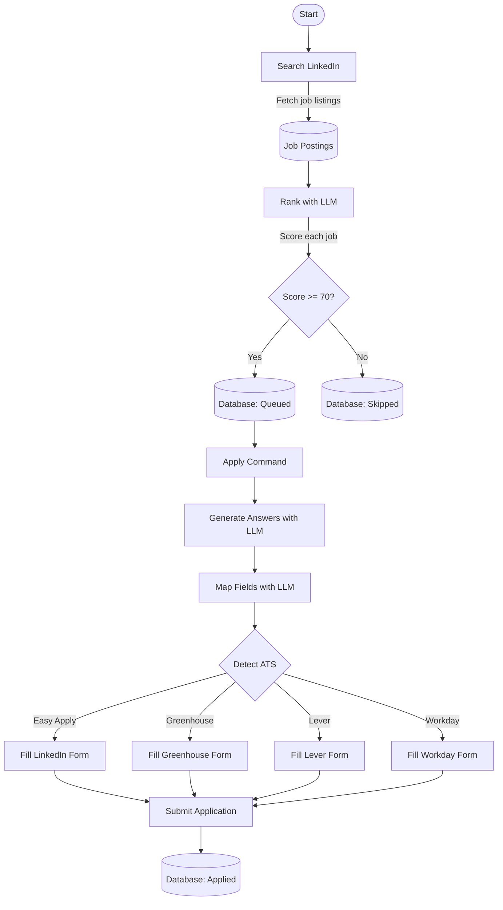

# LinkedIn Job Application Automation

Automatically search, rank, and apply to LinkedIn jobs using local AI.

## Requirements

- **Node.js 20+**: https://nodejs.org/
- **Docker Desktop**: https://www.docker.com/products/docker-desktop/
- **Git**: https://git-scm.com/downloads

## Setup

```bash
git clone <repository-url>
cd job-apply
npm install
npx playwright install
```

Start the local LLM (downloads ~5GB on first run):

```bash
docker compose -f docker-compose.llm.yml up -d
```

Login to LinkedIn:

```bash
npm run login
```

Browser opens for LinkedIn login. Complete authentication, then press ENTER in terminal.

## Usage

### Search for Jobs

```bash
# Basic search
npm run search "Software Engineer"

# With filters
npm run search "Data Analyst" -- --remote --date week --min-score 80

# Profile-based search
npm run search -- --profile core
npm run search -- --profile security
npm run search -- --profile backend

# Start from specific page
npm run search -- --profile core --start-page 2
npm run search -- --profile security --start 3 --max-pages 2
```

Available profiles: `core`, `security`, `event-driven`, `performance`, `devops`, `backend`

### Check Status

```bash
npm run status
npm run list queued
npm run list reported
npm run list applied
```

### Generate Report

```bash
npm run report
```

Creates HTML report in `reports/` folder. All queued jobs are moved to "reported" status, which pauses automatic application until you review and manually change them back to "queued" if desired.

### Apply to Jobs

```bash
# Test run (doesn't submit)
npm run apply -- --easy --dry-run

# Apply to Easy Apply jobs
npm run apply -- --easy

# Apply to external sites (Greenhouse, Lever, Workday)
npm run apply -- --ext
```

### Clear Cache

```bash
npm run clear-cache
npm run clear-cache answers
npm run clear-cache mapping
```

### Reset Skipped Jobs

```bash
node scripts/reset-jobs.js
```

### Dashboard

Monitor your automation in real-time with the web dashboard.

**Initial Setup:**
```bash
# Install dependencies (if not already done)
npm install

# Start the dashboard
npm run dashboard:dev
```

This starts:
- Backend API server on **http://localhost:3001**
- Frontend React app on **http://localhost:3000**

**Access the Dashboard:**
Open http://localhost:3000 to access:
- Live job statistics and success rates
- Complete jobs list with filtering
- Activity log with run history
- Analytics charts and trends
- Screenshot viewer for debugging
- Auto-refreshing every 5 seconds

**Stop the Dashboard:**
Press `Ctrl+C` in the terminal where the dashboard is running.

See [Dashboard Quick Start](docs/DASHBOARD_QUICKSTART.md) for detailed setup guide and troubleshooting.

## Configuration

Edit `.env` file:

- `MIN_FIT_SCORE`: Minimum score to queue jobs (default: 70)
- `LLM_MODEL`: AI model (default: llama3.1:8b-instruct)
- `HEADLESS`: Run browser in background (true/false)
- `ENABLE_TRACING`: Save debug logs (true/false)

Edit `answers-policy.yml` to control application form responses (field length, allowed values, etc.)

Place resumes (PDF or DOCX) in `resumes/` folder.

## Job Scoring

AI evaluates jobs across weighted categories (Core Azure/API Skills 30%, Security 20%, Event-Driven 15%, Performance 15%, DevOps 10%, Seniority 10%). Scores above 70 are queued for application.

## Common Issues

```bash
# AI not responding
docker compose -f docker-compose.llm.yml restart

# Session expired
npm run login

# Check debug info
ls artifacts/  # Screenshots and traces from failed applications
```

## How It Works



## Architecture

### Pipeline

1. **Search & Rank**: Fetch jobs from LinkedIn, LLM scores each job, queues high-fit matches to database
2. **Prepare Answers**: LLM generates application responses based on your profile, validates against policy
3. **Fill Forms**: Detect ATS type, map canonical fields to form fields, fill and submit

### Components

**Commands** (`src/commands/`)
- `search.ts` - Search LinkedIn and rank jobs
- `apply.ts` - Apply to queued jobs
- `report.ts` - Generate HTML reports
- `login.ts` - Authenticate with LinkedIn

**AI** (`src/ai/`)
- `ranker.ts` - Score jobs against your profile
- `answers.ts` - Generate application responses
- `mapper.ts` - Map canonical fields to ATS-specific fields
- `profiles.ts` - Boolean search queries for job profiles
- `client.ts` - Ollama LLM integration with retry logic
- `rag.ts` - Resume context retrieval

**Adapters** (`src/adapters/`)
- `base.ts` - ATS adapter interface
- `greenhouse.ts` - Greenhouse ATS support
- `lever.ts` - Lever ATS support
- `workday.ts` - Workday ATS support

**Library** (`src/lib/`)
- `db.ts` - SQLite database operations
- `session.ts` - Browser session management
- `validation.ts` - Zod schemas for data validation
- `resilience.ts` - Retry and error handling

**Data Storage**
- `data/` - SQLite database (jobs, answers, logs)
- `resumes/` - Resume files for RAG context
- `storage/` - LinkedIn session state
- `artifacts/` - Debug screenshots and traces
- `reports/` - Generated HTML reports

### Tech Stack

- TypeScript 5.6
- Playwright (browser automation)
- SQLite (better-sqlite3)
- Ollama + Llama 3.1 8B
- Zod (validation)
- Yargs (CLI)

### Tests

```bash
npm test
npx tsx --test tests/login.test.ts
npx tsx --test tests/search.test.ts
npx tsx --test tests/mapper.test.ts
npx tsx --test tests/ranker.test.ts
npx tsx --test tests/integration.test.ts
```

## Documentation

Additional documentation is available in the `docs/` folder:

- [Dashboard Monitoring System](docs/dashboard-monitoring-system.plan.md) - Complete dashboard architecture and development plan
- [Dashboard Quick Start](docs/DASHBOARD_QUICKSTART.md) - Quick setup guide for the dashboard
- [Dashboard Status](docs/DASHBOARD_STATUS.md) - Current dashboard implementation status
- [HTTPS Setup](docs/HTTPS_SETUP_COMPLETE.md) - HTTPS configuration guide
- [Phase A Test Report](docs/PHASE_A_TEST_REPORT.md) - Testing results and validation

## Disclaimer

This tool is for personal use. Review applications before submission and respect LinkedIn's terms of service.
